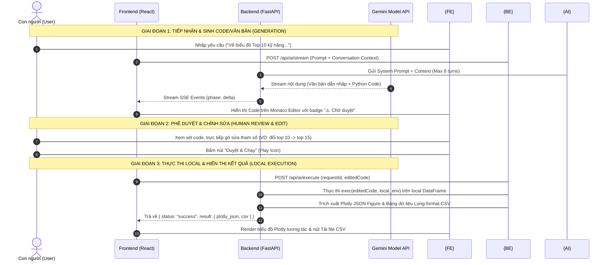

# 🤖 HỆ THỐNG TRỢ LÝ PHÂN TÍCH AI (HUMAN-IN-THE-LOOP AI ANALYST)

> **Tài liệu Thuyết minh Kiến trúc, Luồng Hoạt động và Quy chuẩn Tích hợp AI**  
> Tuân thủ 100% Yêu cầu Tích hợp AI theo hướng dẫn môn học (`Final/docs/ai-guide-v2.pdf`).

---

## 📌 1. Triết lý Thiết kế & Tuyên ngôn Nguyên tắc

Hệ thống AI Analyst được thiết kế theo mô hình **Human-in-the-Loop (Con người là trung tâm quyết định)**, đảm bảo nguyên tắc an toàn dữ liệu và tính minh bạch tuyệt đối:

### 1.1 Vai trò phân định rõ ràng
- **AI (Mô hình Ngôn ngữ Gemini 1.5/2.0)**:
  - Đóng vai trò trợ lý đề xuất ý tưởng phân tích.
  - Viết mã nguồn Python dựa trên yêu cầu ngôn ngữ tự nhiên của người dùng.
  - Trình bày kết quả nhận xét dựa trên số liệu THẬT (không tự bịa đặt số liệu hay hình ảnh).
- **Con người (Người dùng / Nhà phân tích)**:
  - Đóng vai trò **Người phê duyệt và Quyết định (Human Approver)**.
  - Trực tiếp xem xét, gõ sửa/thay đổi các tham số trong đoạn code AI vừa viết (ví dụ: đổi `top 5` thành `top 10`, đổi màu sắc, điều kiện lọc).
  - Quyết định bấm **Duyệt & Chạy** hoặc **Từ chối** đoạn mã.

### 1.2 Nguyên tắc "Không thực thi ngầm" (No Background Execution)
- Mã nguồn Python do AI sinh ra **KHÔNG BAO GIỜ** tự động thực thi bên dưới nền.
- Mọi đoạn code sinh ra mặc định mang trạng thái **`pending_approval` (⚠️ Chờ duyệt)**.
- Chỉ khi người dùng bấm nút **Duyệt & Chạy**, code mới được gửi xuống Backend để thực thi.

### 1.3 Nguyên tắc Thực thi Local (Local Execution Only)
- Mã nguồn Python được thực thi trực tiếp tại máy cục bộ (Local Environment) của người dùng thông qua trình thực thi an toàn của FastAPI (`exec()`).
- Dữ liệu `dff` (Pandas DataFrame) hoàn toàn nằm tại local (`data/processed/vietnam_it_jobs_processed.csv`), không bị đẩy lên các dịch vụ đám mây bên ngoài.

---

## 🏗️ 2. Cấu trúc Kiến trúc Hệ thống AI

Hệ thống AI Analyst bao gồm 2 phần chính được kết nối qua API RESTful và Server-Sent Events (SSE):

```text
[Frontend - ReactJS]                       [Backend - FastAPI Python]
┌─────────────────────────────┐            ┌────────────────────────────────┐
│ • Chat UI & Stream Viewer   │  SSE Stream│ • Gemini API (1.5/2.0 Flash/Pro)│
│ • Monaco Code Editor        │ ◄──────────┤ • Multiple API Keys Fallback   │
│ • Approval Action Toolbar   │            │ • Catalog Routing Engine       │
│ • Plotly Interactive Render │  POST Exec │ • Local Python Executor        │
│ • History Sidebar & CSV Down│ ──────────►│ • Long-format CSV Extractor    │
└─────────────────────────────┘            └────────────────────────────────┘
```

### 2.1 Backend (Python FastAPI)
- **`router_page5.py`**: Router trung tâm tiếp nhận request, kết nối Gemini API, quản lý SSE Stream, thực thi code Python và lưu vết lịch sử.
- **`ai_config.py`**: Quản lý API Key, thiết lập cơ chế **Fallback tự động nhiều API Key khi gặp lỗi Quota 429**, định nghĩa System Prompts chuẩn hóa.
- **`chart_catalog.py`**: Danh mục biểu đồ có sẵn của Dashboard (`P1-01` đến `P4-03`) giúp đối chiếu câu hỏi của người dùng để trả về ngay số liệu chuẩn 100%.

### 2.2 Frontend (ReactJS + Monaco Editor)
- **`Dashboard_page5.jsx`**: View chính quản lý luồng hội thoại streaming real-time.
- **`AiChatMessage.jsx`**: Component tin nhắn thông minh tích hợp **Monaco Editor (chuẩn VS Code)**, thanh Badge trạng thái (`Chờ duyệt`, `Thành công`, `Lỗi`), Nút **Duyệt & Chạy**, Nút Phóng to, Tải file CSV, và Xem Logs.
- **`AiHistoryPanel.jsx`**: Quản lý lịch sử cuộc hội thoại, lưu vết toàn bộ prompt, code, kết quả và nhật ký.
- **`AiRequestForm.jsx`**: Khung nhập prompt hỗ trợ đính kèm ảnh (Vision AI) và các lệnh shortcut (`/hoi`, `/code`, `/giaithich`, `/nhanxet`).

---

## 🔄 3. Luồng Hoạt động Chi tiết (3 Giai đoạn)



---

## 📡 4. Danh mục API Endpoints của AI

### 4.1 `POST /api/ai/stream` (SSE Real-time Streaming)
- **Mục đích**: Nhận prompt từ người dùng và stream kết quả (Văn bản dẫn nhập + Mã nguồn Python) theo thời gian thực.
- **Payload**:
  ```json
  {
    "prompt": "Phân tích xu hướng tuyển dụng theo cấp độ kinh nghiệm",
    "conversationId": "conv_1721643200",
    "image": "data:image/png;base64,...",
    "mode": "auto"
  }
  ```
- **Response Format**: `text/event-stream` (Server-Sent Events)

### 4.2 `POST /api/ai/execute` (Thực thi Mã nguồn đã Phê duyệt)
- **Mục đích**: Chạy đoạn code Python đã được con người duyệt/chỉnh sửa trên DataFrame cục bộ.
- **Payload**:
  ```json
  {
    "requestId": "req_uuid_12345",
    "editedCode": "exp_counts = dff['cap_do_kinh_nghiem'].value_counts().reset_index()\nfig = px.bar(exp_counts, x='Cấp độ', y='Số lượng')"
  }
  ```
- **Response**:
  ```json
  {
    "status": "success",
    "result": {
      "type": "plotly",
      "data": { /* Plotly Figure JSON */ },
      "csv": "trace,nhan_x,gia_tri_y\nCấp độ,Junior,1234\n..."
    },
    "logs": "Vẽ biểu đồ Plotly thành công."
  }
  ```

### 4.3 `GET /api/ai/history` & `DELETE /api/ai/history/{id}`
- **Mục đích**: Tải danh sách nhật ký lịch sử các phiên phân tích hoặc xóa cuộc hội thoại.

---

## 🛠️ 5. Hướng dẫn Thiết lập & Khởi chạy Module AI

1. **Cấu hình Gemini API Key**:
   Tạo hoặc chỉnh sửa file `.env` tại thư mục `dashboard/backend/.env`:
   ```env
   GEMINI_API_KEY=AIzaSy...your_gemini_key_1
   # Bạn có thể thêm nhiều key cách nhau bởi dấu phẩy để hệ thống tự động Fallback:
   # GEMINI_API_KEYS=key1,key2,key3
   ```
2. **Chạy Backend**:
   ```bash
   cd dashboard
   uvicorn backend.main:app --reload --port 8000
   ```
3. **Chạy Frontend**:
   ```bash
   cd dashboard/frontend
   npm run dev
   ```
4. **Truy cập**: Mở trình duyệt tại `http://localhost:5173` và chuyển sang **Tab 5 (AI Analyst)**.

---

## 🌟 6. Các Tính năng Độc đáo Nổi bật

1. **Monaco Code Editor tích hợp**: Trải nghiệm chỉnh sửa code chuyên nghiệp như trên VS Code với syntax highlighting, line numbers và auto-wrap.
2. **Cơ chế API Key Fallback tự động**: Khi một Gemini API Key chạm ngưỡng giới hạn 429 (ResourceExhausted), hệ thống tự động chuyển sang API Key dự phòng mà không ngắt đoạn trải nghiệm của người dùng.
3. **Trích xuất CSV tự động từ Biểu đồ (`extract_csv_from_figure`)**: Tự động chuyển đổi các Plotly Figures (Pie, Bar, Boxplot, Treemap, Heatmap) thành dạng bảng số liệu CSV chuẩn long-format cho người dùng tải về.
4. **Phân tích hình ảnh (Vision AI)**: Đọc hiểu và đưa ra nhận xét chuyên sâu từ các ảnh biểu đồ/bảng số liệu do người dùng tải lên.
5. **Catalog Matching**: Tự động nhận biết các câu hỏi khớp với biểu đồ sẵn có trên Dashboard để dùng ngay số liệu chuẩn 100%, chống hiện tượng tự bịa số liệu (Hallucination).

---

## 📋 7. Quy trình Kiểm thử & Bảo vệ (Demo với Giảng viên)

Khi trình diễn chức năng AI cho môn học, thực hiện theo đúng 3 bước minh họa chuẩn **Human-in-the-Loop**:

1. **Bước 1 (Nhập prompt & Sinh code)**: Nhập câu hỏi *"Phân tích top 5 nhóm vị trí tuyển dụng nhiều nhất"*. AI sẽ sinh ra code Python và hiển thị ở trạng thái **⚠️ Chờ duyệt**.
2. **Bước 2 (Con người can thiệp gõ sửa)**: Trực tiếp gõ sửa trong khung Monaco Editor từ `nlargest(5)` thành `nlargest(8)` và đổi màu biểu đồ.
3. **Bước 3 (Duyệt & Thực thi)**: Bấm nút **"Duyệt & Chạy"** (`Play` icon). Biểu đồ Plotly tương tác sẽ hiển thị ra ngay bên dưới kèm nút tải CSV số liệu thô.
