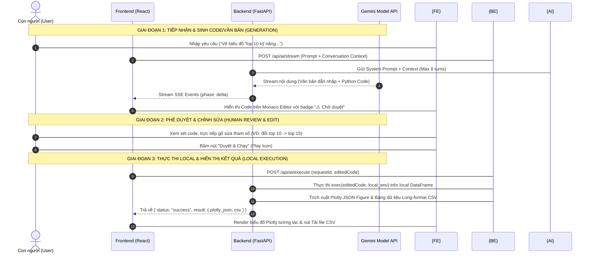

# 🤖 HỆ THỐNG TRỢ LÝ PHÂN TÍCH AI (HUMAN-IN-THE-LOOP AI ANALYST)

> **Tài liệu Thuyết minh Kiến trúc, Luồng Hoạt động và Quy chuẩn Tích hợp AI**  
> Tuân thủ 100% Yêu cầu Tích hợp AI theo hướng dẫn môn học (`Final/docs/ai-guide-v2.pdf`).

---

## 🚀 HƯỚNG DẪN SỬ DỤNG NHANH DÀNH CHO NGƯỜI DÙNG

> 📍 Chức năng AI nằm ở **Tab cuối cùng** của Dashboard — Tab có icon 🤖 hoặc nhãn **AI Analyst**.

---

### ① Bắt đầu — Nhập câu hỏi/yêu cầu

Ở phía dưới màn hình, trong ô nhập liệu **"Nhập yêu cầu phân tích..."**, bạn gõ bất kỳ câu hỏi nào bằng **tiếng Việt hoặc tiếng Anh**, rồi nhấn **Enter** hoặc bấm nút **Gửi** (icon ▶️).

**Ví dụ bạn có thể gõ:**
- `"Top 10 kỹ năng được tuyển dụng nhiều nhất"`
- `"So sánh mức lương theo cấp độ kinh nghiệm"`
- `"Vẽ biểu đồ phân bố vị trí công việc theo vùng miền"`
- `"Nhóm nào có mức lương trung bình cao nhất?"`
- `"Xu hướng tuyển dụng tháng nào cao nhất trong năm?"`

---

### ② Dùng Lệnh Nhanh (Shortcuts)

Gõ các lệnh sau vào ô chat để ra kết quả đúng loại mình muốn:

| Lệnh | Tác dụng |
|---|---|
| `/hoi` | Đặt câu hỏi thống kê, AI trả lời bằng **văn bản + số liệu** |
| `/code` | Yêu cầu AI **viết code Python** vẽ biểu đồ theo ý bạn |
| `/giaithich` | Đề nghị AI **giải thích** một kết quả hoặc biểu đồ đang hiển thị |
| `/nhanxet` | Yêu cầu AI **nhận xét, đưa ra insights** từ dữ liệu hiện tại |

**Ví dụ kết hợp:**
```
/code Vẽ biểu đồ tròn thể hiện tỉ lệ hình thức làm việc (full-time, part-time, remote...)
```

---

### ③ Đính kèm Ảnh để Phân tích (Vision AI)

Bạn có thể **chụp/xuất ảnh biểu đồ** từ Dashboard rồi đính kèm vào ô chat để yêu cầu AI nhận xét:

1. Bấm nút **📎 (Đính kèm ảnh)** bên cạnh ô nhập liệu.
2. Chọn ảnh biểu đồ từ máy tính.
3. Gõ thêm câu hỏi, ví dụ: `"Nhận xét về xu hướng trong biểu đồ này"` rồi Gửi.

> AI sẽ đọc ảnh và đưa ra phân tích chuyên sâu, không bịa số liệu.

---

### ④ Xem xét & Chỉnh sửa Code (Bước Quan trọng nhất!)

Sau khi AI sinh ra code Python, nó sẽ hiển thị trong một **khung code Monaco Editor** (giống VS Code) với badge màu vàng **"⚠️ Chờ duyệt"**.

**Lúc này bạn CÓ THỂ:**

- ✏️ **Trực tiếp gõ sửa code** trong khung đó — ví dụ:
  - Đổi `nlargest(5)` thành `nlargest(10)` để lấy Top 10 thay vì Top 5
  - Đổi màu sắc `color='#59B292'` thành màu bạn thích
  - Thêm điều kiện lọc thêm theo ý muốn
- 🔍 **Phóng to** khung code để đọc dễ hơn (bấm nút ⬜ góc phải)
- ❌ **Từ chối** và yêu cầu AI viết lại nếu không ưng

---

### ⑤ Duyệt & Chạy Code

Sau khi xem xét (và tùy chỉnh nếu muốn), bấm nút **▶️ "Duyệt & Chạy"**:

- Hệ thống thực thi code ngay trên máy tính của bạn với bộ dữ liệu thực.
- **Biểu đồ Plotly tương tác** sẽ hiển thị ngay bên dưới — bạn có thể hover, zoom, pan.
- Nút **⬇️ Tải CSV** xuất hiện — bấm để tải bảng số liệu thô định dạng `.csv`.
- Nút **📋 Xem Logs** để xem chi tiết quá trình thực thi.

---

### ⑥ Xem & Quản lý Lịch sử

Bên **cột trái** của trang AI có panel **Lịch sử**:

- Xem lại toàn bộ các câu hỏi và kết quả trước đó trong phiên làm việc.
- Bấm vào một mục để xem lại biểu đồ/phân tích đó.
- Bấm nút 🗑️ để xóa một cuộc hội thoại không cần thiết.

---

### 💡 Một số câu hỏi mẫu hay dùng

```
Top 10 kỹ năng lập trình được yêu cầu nhiều nhất
```
```
Phân phối mức lương theo nhóm vị trí công việc (boxplot)
```
```
So sánh số lượng tuyển dụng giữa Hà Nội và TP.HCM theo từng tháng
```
```
Tỉ lệ % các nhóm kinh nghiệm (Junior, Mid, Senior, Lead) trong dataset
```
```
Nhận xét xu hướng tuyển dụng IT tại Việt Nam từ dữ liệu hiện có
```
```
Heatmap thể hiện mức lương trung bình theo kinh nghiệm và vị trí công việc
```

---

### ⚠️ Lưu ý quan trọng

| Điều cần biết | Giải thích |
|---|---|
| **AI không tự chạy code** | Code AI sinh ra luôn ở trạng thái "Chờ duyệt" — bạn phải chủ động bấm Duyệt & Chạy |
| **Dữ liệu hoàn toàn cục bộ** | Dữ liệu `vietnam_it_jobs_processed.csv` chỉ ở máy bạn, không gửi lên cloud |
| **AI có thể sai** | Hãy luôn xem lại code trước khi duyệt; bạn có thể sửa tham số tùy ý |
| **Quota Gemini** | Nếu thấy báo lỗi "Quota", hệ thống tự động chuyển sang API Key dự phòng |
| **Giới hạn ngữ cảnh** | AI nhớ tối đa **8 lượt hội thoại** gần nhất trong một phiên |

---


---

---

## 🗂️ CẤU TRÚC CÀI ĐẶT CHI TIẾT

### Sơ đồ thư mục liên quan đến AI

```
Final/
├── README_AI.md                          ← Tài liệu này
│
├── dashboard/
│   ├── backend/
│   │   ├── .env                          ← Chứa GEMINI_API_KEY(S) — KHÔNG commit lên git
│   │   ├── ai_config.py                  ← [CẤU HÌNH AI] Model, API keys, System prompts
│   │   ├── ai_history.json               ← [DỮ LIỆU] Lịch sử hội thoại lưu local (JSON)
│   │   ├── ai_prepared_questions.json    ← [DỮ LIỆU] Câu hỏi mẫu gợi ý cho người dùng
│   │   ├── chart_catalog.py              ← [CATALOG] Danh mục 13+ biểu đồ sẵn có (P1-01..P4-03)
│   │   │
│   │   └── routers/
│   │       └── router_page5.py           ← [ROUTER CHÍNH] Toàn bộ logic API AI (786 dòng)
│   │
│   └── frontend/
│       └── src/
│           ├── components/
│           │   ├── Dashboard_page5.jsx   ← [VIEW CHÍNH] Trang AI — quản lý streaming, layout
│           │   └── ai/
│           │       ├── AiChatMessage.jsx ← [COMPONENT] Tin nhắn AI + Monaco Editor + Nút duyệt
│           │       ├── AiHistoryPanel.jsx← [COMPONENT] Panel lịch sử bên trái
│           │       ├── AiRequestForm.jsx ← [COMPONENT] Ô nhập prompt + đính kèm ảnh
│           │       └── AiService.js      ← [SERVICE] Gọi API Backend (stream, execute, history)
│           └── styles/
│               └── style.css             ← CSS cho giao diện AI (chat bubble, Monaco, badges...)
```

---

### Chi tiết từng file Backend

#### `backend/ai_config.py` — Cấu hình trung tâm

| Hằng số / Biến | Giá trị mặc định | Mô tả |
|---|---|---|
| `GEMINI_MODEL_NAME` | `gemini-pro-latest` | Model chính sinh code/phân tích (có thể override qua `.env`) |
| `TITLE_MODEL_NAME` | `gemini-flash-latest` | Model tự đặt tiêu đề cuộc hội thoại (nhanh/rẻ hơn) |
| `ROUTING_MODEL_NAME` | `gemini-flash-latest` | Model định tuyến câu hỏi vào catalog biểu đồ có sẵn |
| `GEMINI_API_KEYS` | Đọc từ `.env` | Danh sách key phân cách bởi dấu phẩy, fallback tự động khi quota 429 |
| `SYSTEM_PROMPT` | (dài ~50 dòng) | Hướng dẫn AI về dataset, cột dữ liệu, quy tắc sinh code Plotly |
| `VISION_PROMPT` | (dài ~20 dòng) | System prompt riêng khi AI phân tích ảnh (Vision mode) |
| `ROUTING_PROMPT_TEMPLATE` | (template) | Prompt để AI định tuyến câu hỏi → mã catalog (VD: `P2-02`) |
| `COMMENT_PROMPT_TEMPLATE` | (template) | Prompt để AI viết nhận xét dựa trên CSV số liệu thật |

**Cấu hình `.env`:**
```env
# Bắt buộc — ít nhất 1 key
GEMINI_API_KEY=AIzaSy...your_key

# Tùy chọn — nhiều key để fallback tự động khi hết quota
GEMINI_API_KEYS=key1,key2,key3

# Tùy chọn — ghi đè model mặc định
GEMINI_MODEL_NAME=gemini-2.5-pro
TITLE_MODEL_NAME=gemini-2.0-flash
ROUTING_MODEL_NAME=gemini-2.0-flash
```

---

#### `backend/chart_catalog.py` — Danh mục biểu đồ sẵn có

Chứa định nghĩa **13+ biểu đồ** với mã định danh `P{trang}-{số}`:

| Mã | Trang | Mô tả biểu đồ |
|---|---|---|
| `P1-01` | Trang 1 | Xu hướng tuyển dụng theo thời gian |
| `P1-02` | Trang 1 | Phân bố tuyển dụng theo vùng miền |
| `P1-03` | Trang 1 | Hình thức làm việc |
| `P2-01` | Trang 2 | Phân phối mức lương |
| `P2-02` | Trang 2 | Mức lương trung bình theo vị trí |
| `P2-03` | Trang 2 | Mức lương theo kinh nghiệm |
| `P3-01` | Trang 3 | Heatmap lương theo vị trí × kinh nghiệm |
| `P3-02` | Trang 3 | Biểu đồ kỹ năng/công nghệ phổ biến |
| `P4-01` | Trang 4 | Phân bố theo nhóm vị trí công việc |
| `P4-02` | Trang 4 | Top công ty tuyển dụng |
| ... | Mở rộng | Các biểu đồ phân tích bổ sung chỉ dùng cho AI |

**Các hàm trong `chart_catalog.py`:**

```python
get_catalog_prompt_listing()    # Sinh text liệt kê catalog để đưa vào routing prompt
get_catalog_item(chart_id)      # Lấy định nghĩa 1 biểu đồ theo mã (VD: "P2-02")
get_suggestions(current_id)     # Gợi ý 2 biểu đồ liên quan để AI đề xuất thêm
```

---

#### `backend/routers/router_page5.py` — Router AI chính (786 dòng)

**Các hàm tiện ích nội bộ:**

```python
generate_with_key_fallback(prompt, model_name)
# Gọi Gemini API, tự fallback sang key tiếp theo khi gặp lỗi quota 429

stream_text_from_prompt(prompt_or_content, model_name)
# Generator stream từng chunk text từ Gemini theo thời gian thực (SSE)

route_question_to_catalog(question)
# Dùng Gemini Flash định tuyến câu hỏi → mã catalog hoặc None

get_catalog_chart_data(catalog_id)
# Gọi hàm vẽ biểu đồ thật, rút CSV long-format, trả về {fig, fig_json, csv}

generate_catalog_comment(question, csv_text)
# Viết nhận xét phân tích dựa trên bảng số liệu thật (không bịa)

generate_title(prompt)
# Đặt tiêu đề ngắn (<6 từ) cho cuộc hội thoại mới (dùng Flash)

build_conversation_context(history, conversation_id)
# Dựng lại ngữ cảnh tối đa 8 lượt hội thoại trước cho model nhớ

extract_csv_from_figure(fig)
# Trích xuất bảng số liệu long-format CSV từ Plotly Figure (Bar/Pie/Box/Heatmap...)
```

**Các API Endpoint:**

```
POST /api/ai/request           → Xử lý prompt, sinh code/văn bản (không stream)
POST /api/ai/request/stream    → Xử lý prompt và STREAM kết quả qua SSE theo thời gian thực
POST /api/ai/execute           → Thực thi code Python đã được người dùng duyệt
GET  /api/ai/history           → Lấy danh sách toàn bộ lịch sử hội thoại
DELETE /api/ai/history/{id}    → Xóa 1 cuộc hội thoại
POST /api/ai/history/{id}/pin  → Ghim/bỏ ghim 1 cuộc hội thoại
```

---

### Chi tiết từng file Frontend

#### `frontend/src/components/ai/AiService.js` — Lớp giao tiếp API

Chứa các hàm gọi API backend:
```js
streamAiRequest(prompt, conversationId, image, onChunk, onDone, onError)
// Kết nối SSE, nhận từng chunk text từ backend, gọi callback onChunk mỗi lần có dữ liệu

executeCode(requestId, editedCode)
// POST /api/ai/execute — gửi code đã duyệt, nhận về kết quả biểu đồ + CSV

loadHistory()            // GET /api/ai/history
deleteConversation(id)   // DELETE /api/ai/history/{id}
pinConversation(id)      // POST /api/ai/history/{id}/pin
```

#### `frontend/src/components/ai/AiChatMessage.jsx` — Component tin nhắn AI

Quản lý toàn bộ **vòng đời 1 tin nhắn AI**:
- Hiển thị văn bản dẫn nhập (markdown rendered)
- Render khung **Monaco Code Editor** (syntax highlighting Python)
- Badge trạng thái: `⚠️ Chờ duyệt` → `⏳ Đang chạy...` → `✅ Thành công` / `❌ Lỗi`
- Nút **▶️ Duyệt & Chạy** — gọi `executeCode()`
- Nút **⬜ Phóng to** — mở Monaco fullscreen
- Nút **⬇️ Tải CSV** — xuất file `.csv` số liệu thô
- Nút **📋 Xem Logs** — hiện log thực thi Python
- Render **Plotly Figure** tương tác sau khi thực thi thành công

#### `frontend/src/components/ai/AiHistoryPanel.jsx` — Panel lịch sử

- Liệt kê tất cả cuộc hội thoại theo thời gian
- Phân nhóm: **Ghim 📌** / **Hôm nay** / **7 ngày qua** / **Cũ hơn**
- Click để load lại 1 cuộc hội thoại vào khung chat chính
- Nút xóa 🗑️ từng cuộc hội thoại

#### `frontend/src/components/ai/AiRequestForm.jsx` — Form nhập prompt

- Ô textarea tự co giãn theo độ dài nội dung
- Hỗ trợ **đính kèm ảnh** (📎) — preview ảnh trước khi gửi
- Nhận diện và gợi ý **lệnh shortcut** (`/hoi`, `/code`, `/giaithich`, `/nhanxet`)
- Hiển thị câu hỏi mẫu gợi ý từ `ai_prepared_questions.json`
- Gửi bằng `Enter` (Shift+Enter = xuống dòng)

#### `frontend/src/components/Dashboard_page5.jsx` — View tổng thể trang AI

- Quản lý state toàn trang: `messages[]`, `isStreaming`, `currentConversationId`
- Điều phối luồng SSE streaming từ `AiService.streamAiRequest()`
- Tự động scroll xuống cuối khi có tin nhắn mới
- Hiển thị animation "AI đang gõ..." trong khi đang stream

---

### Sơ đồ luồng dữ liệu nội bộ

```
Người dùng nhập prompt
        │
        ▼
AiRequestForm.jsx
        │ gọi AiService.streamAiRequest()
        ▼
POST /api/ai/request/stream (SSE)
        │
        ├─► route_question_to_catalog()  ──► khớp catalog?
        │        ├── CÓ: get_catalog_chart_data()  ──► fig + CSV thật
        │        │         └── generate_catalog_comment()  ──► nhận xét AI
        │        └── KHÔNG: build_conversation_context()
        │                     └── stream_text_from_prompt()  ──► sinh code Python
        │
        ▼ (SSE stream chunks → onChunk callback)
Dashboard_page5.jsx cập nhật AiChatMessage.jsx
        │
        ▼ (người dùng bấm Duyệt & Chạy)
POST /api/ai/execute
        │
        ├── exec(editedCode, local_env)  ← thực thi tại local máy người dùng
        ├── extract_csv_from_figure(fig) ← rút bảng số liệu
        └── trả về { plotly_json, csv, logs }
        │
        ▼
AiChatMessage.jsx render Plotly chart + hiện nút Tải CSV
```

---

## 📌 1. Triết lý Thiết kế & Tuyên ngôn Nguyên tắc


Hệ thống AI Analyst được thiết kế theo mô hình **Human-in-the-Loop (Con người là trung tâm quyết định)**, đảm bảo nguyên tắc an toàn dữ liệu và tính minh bạch tuyệt đối:

### 1.1 Vai trò phân định rõ ràng
- **AI (Mô hình Ngôn ngữ Gemini 1.5/2.0)**:
  - Đóng vai trò trợ lý đề xuất ý tưởng phân tích.
  - Viết mã nguồn Python dựa trên yêu cầu ngôn ngữ tự nhiên của người dùng.
  - Trình bày kết quả nhận xét dựa trên số liệu THẬT (không tự bịa đặt số liệu hay hình ảnh).
- **Con người (Người dùng / Nhà phân tích)**:
  - Đóng vai trò **Người phê duyệt và Quyết định (Human Approver)**.
  - Trực tiếp xem xét, gõ sửa/thay đổi các tham số trong đoạn code AI vừa viết (ví dụ: đổi `top 5` thành `top 10`, đổi màu sắc, điều kiện lọc).
  - Quyết định bấm **Duyệt & Chạy** hoặc **Từ chối** đoạn mã.

### 1.2 Nguyên tắc "Không thực thi ngầm" (No Background Execution)
- Mã nguồn Python do AI sinh ra **KHÔNG BAO GIỜ** tự động thực thi bên dưới nền.
- Mọi đoạn code sinh ra mặc định mang trạng thái **`pending_approval` (⚠️ Chờ duyệt)**.
- Chỉ khi người dùng bấm nút **Duyệt & Chạy**, code mới được gửi xuống Backend để thực thi.

### 1.3 Nguyên tắc Thực thi Local (Local Execution Only)
- Mã nguồn Python được thực thi trực tiếp tại máy cục bộ (Local Environment) của người dùng thông qua trình thực thi an toàn của FastAPI (`exec()`).
- Dữ liệu `dff` (Pandas DataFrame) hoàn toàn nằm tại local (`data/processed/vietnam_it_jobs_processed.csv`), không bị đẩy lên các dịch vụ đám mây bên ngoài.

---

## 🏗️ 2. Cấu trúc Kiến trúc Hệ thống AI

Hệ thống AI Analyst bao gồm 2 phần chính được kết nối qua API RESTful và Server-Sent Events (SSE):

```text
[Frontend - ReactJS]                       [Backend - FastAPI Python]
┌─────────────────────────────┐            ┌────────────────────────────────┐
│ • Chat UI & Stream Viewer   │  SSE Stream│ • Gemini API (1.5/2.0 Flash/Pro)│
│ • Monaco Code Editor        │ ◄──────────┤ • Multiple API Keys Fallback   │
│ • Approval Action Toolbar   │            │ • Catalog Routing Engine       │
│ • Plotly Interactive Render │  POST Exec │ • Local Python Executor        │
│ • History Sidebar & CSV Down│ ──────────►│ • Long-format CSV Extractor    │
└─────────────────────────────┘            └────────────────────────────────┘
```

### 2.1 Backend (Python FastAPI)
- **`router_page5.py`**: Router trung tâm tiếp nhận request, kết nối Gemini API, quản lý SSE Stream, thực thi code Python và lưu vết lịch sử.
- **`ai_config.py`**: Quản lý API Key, thiết lập cơ chế **Fallback tự động nhiều API Key khi gặp lỗi Quota 429**, định nghĩa System Prompts chuẩn hóa.
- **`chart_catalog.py`**: Danh mục biểu đồ có sẵn của Dashboard (`P1-01` đến `P4-03`) giúp đối chiếu câu hỏi của người dùng để trả về ngay số liệu chuẩn 100%.

### 2.2 Frontend (ReactJS + Monaco Editor)
- **`Dashboard_page5.jsx`**: View chính quản lý luồng hội thoại streaming real-time.
- **`AiChatMessage.jsx`**: Component tin nhắn thông minh tích hợp **Monaco Editor (chuẩn VS Code)**, thanh Badge trạng thái (`Chờ duyệt`, `Thành công`, `Lỗi`), Nút **Duyệt & Chạy**, Nút Phóng to, Tải file CSV, và Xem Logs.
- **`AiHistoryPanel.jsx`**: Quản lý lịch sử cuộc hội thoại, lưu vết toàn bộ prompt, code, kết quả và nhật ký.
- **`AiRequestForm.jsx`**: Khung nhập prompt hỗ trợ đính kèm ảnh (Vision AI) và các lệnh shortcut (`/hoi`, `/code`, `/giaithich`, `/nhanxet`).

---

## 🔄 3. Luồng Hoạt động Chi tiết (3 Giai đoạn)



---

## 📡 4. Danh mục API Endpoints của AI

### 4.1 `POST /api/ai/stream` (SSE Real-time Streaming)
- **Mục đích**: Nhận prompt từ người dùng và stream kết quả (Văn bản dẫn nhập + Mã nguồn Python) theo thời gian thực.
- **Payload**:
  ```json
  {
    "prompt": "Phân tích xu hướng tuyển dụng theo cấp độ kinh nghiệm",
    "conversationId": "conv_1721643200",
    "image": "data:image/png;base64,...",
    "mode": "auto"
  }
  ```
- **Response Format**: `text/event-stream` (Server-Sent Events)

### 4.2 `POST /api/ai/execute` (Thực thi Mã nguồn đã Phê duyệt)
- **Mục đích**: Chạy đoạn code Python đã được con người duyệt/chỉnh sửa trên DataFrame cục bộ.
- **Payload**:
  ```json
  {
    "requestId": "req_uuid_12345",
    "editedCode": "exp_counts = dff['cap_do_kinh_nghiem'].value_counts().reset_index()\nfig = px.bar(exp_counts, x='Cấp độ', y='Số lượng')"
  }
  ```
- **Response**:
  ```json
  {
    "status": "success",
    "result": {
      "type": "plotly",
      "data": { /* Plotly Figure JSON */ },
      "csv": "trace,nhan_x,gia_tri_y\nCấp độ,Junior,1234\n..."
    },
    "logs": "Vẽ biểu đồ Plotly thành công."
  }
  ```

### 4.3 `GET /api/ai/history` & `DELETE /api/ai/history/{id}`
- **Mục đích**: Tải danh sách nhật ký lịch sử các phiên phân tích hoặc xóa cuộc hội thoại.

---

## 🛠️ 5. Hướng dẫn Thiết lập & Khởi chạy Module AI

1. **Cấu hình Gemini API Key**:
   Tạo hoặc chỉnh sửa file `.env` tại thư mục `dashboard/backend/.env`:
   ```env
   GEMINI_API_KEY=AIzaSy...your_gemini_key_1
   # Bạn có thể thêm nhiều key cách nhau bởi dấu phẩy để hệ thống tự động Fallback:
   # GEMINI_API_KEYS=key1,key2,key3
   ```
2. **Chạy Backend**:
   ```bash
   cd dashboard
   uvicorn backend.main:app --reload --port 8000
   ```
3. **Chạy Frontend**:
   ```bash
   cd dashboard/frontend
   npm run dev
   ```
4. **Truy cập**: Mở trình duyệt tại `http://localhost:5173` và chuyển sang **Tab 5 (AI Analyst)**.

---

## 🌟 6. Các Tính năng Độc đáo Nổi bật

1. **Monaco Code Editor tích hợp**: Trải nghiệm chỉnh sửa code chuyên nghiệp như trên VS Code với syntax highlighting, line numbers và auto-wrap.
2. **Cơ chế API Key Fallback tự động**: Khi một Gemini API Key chạm ngưỡng giới hạn 429 (ResourceExhausted), hệ thống tự động chuyển sang API Key dự phòng mà không ngắt đoạn trải nghiệm của người dùng.
3. **Trích xuất CSV tự động từ Biểu đồ (`extract_csv_from_figure`)**: Tự động chuyển đổi các Plotly Figures (Pie, Bar, Boxplot, Treemap, Heatmap) thành dạng bảng số liệu CSV chuẩn long-format cho người dùng tải về.
4. **Phân tích hình ảnh (Vision AI)**: Đọc hiểu và đưa ra nhận xét chuyên sâu từ các ảnh biểu đồ/bảng số liệu do người dùng tải lên.
5. **Catalog Matching**: Tự động nhận biết các câu hỏi khớp với biểu đồ sẵn có trên Dashboard để dùng ngay số liệu chuẩn 100%, chống hiện tượng tự bịa số liệu (Hallucination).

---

## 📋 7. Quy trình Kiểm thử & Bảo vệ (Demo với Giảng viên)

Khi trình diễn chức năng AI cho môn học, thực hiện theo đúng 3 bước minh họa chuẩn **Human-in-the-Loop**:

1. **Bước 1 (Nhập prompt & Sinh code)**: Nhập câu hỏi *"Phân tích top 5 nhóm vị trí tuyển dụng nhiều nhất"*. AI sẽ sinh ra code Python và hiển thị ở trạng thái **⚠️ Chờ duyệt**.
2. **Bước 2 (Con người can thiệp gõ sửa)**: Trực tiếp gõ sửa trong khung Monaco Editor từ `nlargest(5)` thành `nlargest(8)` và đổi màu biểu đồ.
3. **Bước 3 (Duyệt & Thực thi)**: Bấm nút **"Duyệt & Chạy"** (`Play` icon). Biểu đồ Plotly tương tác sẽ hiển thị ra ngay bên dưới kèm nút tải CSV số liệu thô.
